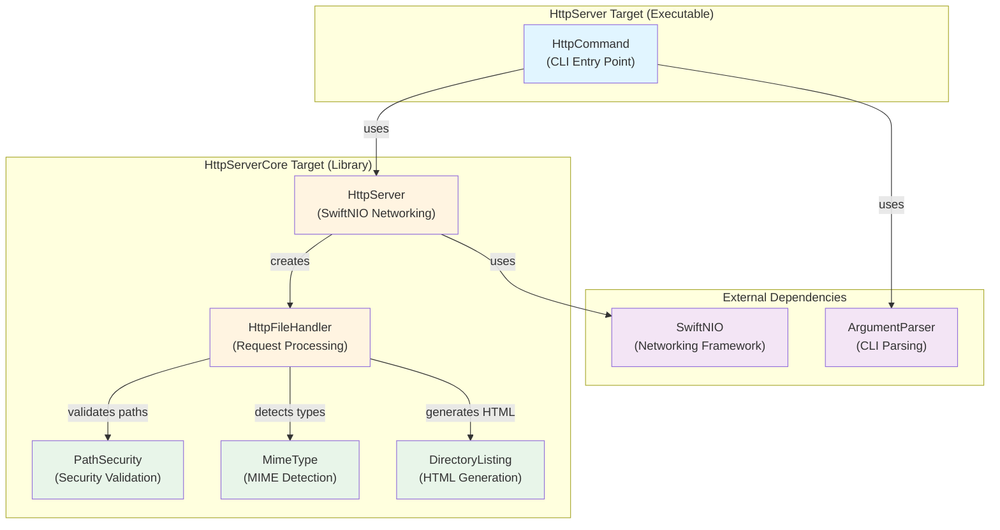

# Swift HTTP Server

A command-line HTTP server for serving static files, built with Swift and SwiftNIO.

## Features

A minimal HTTP server optimized for local development with everything you need to serve static files efficiently.

### Core Functionality
- **Static file serving** - Serves HTML, CSS, JavaScript, JSON, images, and other common file types
- **Automatic MIME type detection** - Proper Content-Type headers for HTML, CSS, JS, JSON, PNG, JPG, GIF, SVG, and more
- **Directory listing** - Automatic HTML generation with browsable file/folder lists when no index.html exists
- **Fast startup** - Lightweight server starts instantly on any available port

### HTTP Capabilities
- **HTTP/1.1 protocol** - Built on SwiftNIO's NIOHTTP1 module for standards-compliant HTTP
- **Persistent connections** - Automatic keep-alive support for better performance
- **GET request support** - Full support for serving files via GET requests
- **Proper status codes** - Returns appropriate HTTP responses (200 OK, 404 Not Found, 403 Forbidden, 405 Method Not Allowed, 500 Internal Server Error)
- **Standard headers** - Correct Content-Type and Content-Length headers for all responses

### Security
- **Directory traversal protection** - PathSecurity module prevents access outside document root
- **Path sanitization** - Removes dangerous path components like `..` automatically
- **Safe file serving** - Only serves files within the specified directory

### Developer Experience
- **Simple CLI interface** - Easy command-line arguments with ArgumentParser
- **Dual-output logging** - Console logging for info/errors, file logging for complete debug output
- **Configurable** - Custom port, host binding, and log file location
- **Graceful shutdown** - Clean SIGINT handling with proper resource cleanup
- **Cross-platform** - Works on macOS and Linux with Swift 6

### What's Intentionally Excluded
This server is designed for **local development only**, not production use. The following features are intentionally omitted:
- POST/PUT/DELETE methods (not needed for static file serving)
- Caching headers (you want fresh content during development)
- Content compression (localhost performance is excellent without it)
- Authentication/authorization (it's your local machine)
- HTTPS/TLS (use a reverse proxy if needed)
- Advanced HTTP/1.1 features like range requests, conditional requests, or content negotiation

## Architecture



**Key Components**:
- **HttpCommand**: CLI interface using ArgumentParser for command-line argument parsing
- **HttpServer**: SwiftNIO-based server with async/await support and multi-threaded event loop
- **HttpFileHandler**: Channel handler for HTTP request processing and file serving
- **PathSecurity**: Security utilities preventing directory traversal attacks
- **MimeType**: MIME type detection for proper Content-Type headers
- **DirectoryListing**: HTML generation for directory browsing

## Installation

```bash
git clone https://github.com/ljtill/swift-http-server.git
cd swift-http-server
swift build -c release
```

## Usage

```bash
# Serve files from current directory on port 3000
swift run HttpServer .

# Custom directory and port
swift run HttpServer /path/to/directory --port 3000

# Custom host and port
swift run HttpServer /path/to/directory --host 0.0.0.0 --port 3000
```

## Development

```bash
# Run tests
swift test

# Build for release
swift build -c release
```